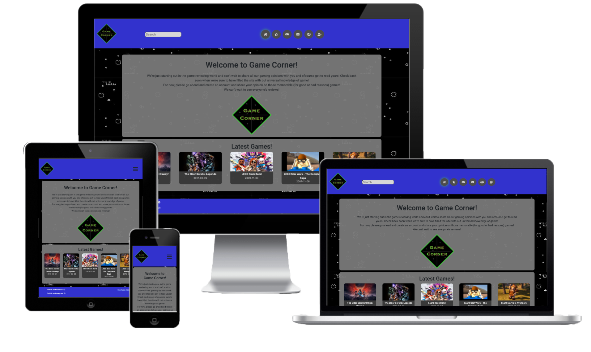

# Milestone-Project-3

## 

## Project

The purpose of this site will be to allow users to add their review for a recently played game. If the game does not exist in the archive, a user would be able to add the game to the archive. Users would also be able to search for a game to read reviews on it. A link will be available to users to purchase the game from an affiliate site.

# Showcase

A deployed link to the site can be found on Heroku [here](https://mp3-game-corner.herokuapp.com/)

# UX

## User Story

- The end user for the site is someone who is interesed in video games and wants:
    - Find reviews on a game
    - Leave a review for a game
- The user may also want to discover games by looking a highly rated reviews
- The user may wish to purchase the game after reading reviews and a link will be available.
- The site's main access will be on mobile, as users will generally access the site when on the move as reading material.
- The end user will want to be able to easily find the game that they are interested in and either quicky read a review or post their own. Information will need to be easily accessible and clear.

## Strategy

### User Needs

- The user needs the site to be fully functionaly on a mobile device as it will be on a tablet or desktop.
- Information must be easy to access, clearly displayed and easy to digest.
- Easily understand how the site works. Access to a profile page to leave a review will need to be simple.
- Be able to search for a game quickly and concisely.
- Be able to find where to purchase the game if they like the reviews.

### Technical Capabilities

It is possible to create this site efficiently using the bootstrap framework and HTML/CSS/Javascript/Python that I have learned along with knowledge of the a mongodb database. Apis will also be used for getting extra information on the game, such as videos

### Business Vision

To create a community for like minded individuals who enjoy gaming, providing a useful resource. Simplicity of the site will be 
required and speed at the forefront so the user is not delayed in their search.
Afilliate links will be available to purchase games to help with costs of the site.

## Scope

The site will quickly show what it's purpose is for a user. A search will be easy to complete by a user without logging in.

The site will include an about section detailing what the site does and what a user can gain from it.
It will be easy to enact a search and read the results.
All information will be clearly laid out and easy to understand at a glance

## Structure

- The site will be detailed but simply laid out, cover 15 pages in total with some pages generated when clicked on.
- The navigation bar will give access to the mainpages of the site
- Site pages - Login, Register, Latest Reviews, Games, Game,  Profile(If logged in)
- User will be able to search for a game from the navigation bar at the top of the page.
- Each user will have a profile page with access to adding games and reviews, changing their password and view all of their reviews
- An admin panel will be accesiable by admin users allowing reviews, games and users to be managed
- A contact us modal will be availabe on all pages

## Skeleton

### Wireframes
- Wireframes were created at the begining of the project and will be used to create the site as closly as possible
## Original

- [Mobile >576px](static/wireframes/SM.png)
- [Tablet ≥768px](static/wireframes/MD.png)
- [Desktop ≥1400px](static/wireframes/LG.png)

## Surface

The site will be set over multiple pages with the ability for users to add and remove infomation relating to games

### Home
- The page will be presented to the user showing the goals of the site.
- There will be a cached latest games section

### Register Page
- Available from the navigation menu
- A page for a user to enter their details to register to the site

### Login Page
- Available from the navigation menu
- Page for a registered user to login

### Profile Page

- Once a user has signed up, they will have access to their prescence on the site.
- Their reviews will be available along with the ability to add more.
- They will be able to search for a game and add it to the site if it does not exist.
- They will have quick access to the latest reviews

### Game search page from profile

- When the user wants to add a new review, they will need to search for the games first.
- If the game is not on the site, they will be able to run a search via the RAWG API

### New Game Page

- If a game is not currently on the site, the user will be able to add it from the API result
### New Review

- The user will be able to leave a review for the game they have selected, if logged in.
- Page is simple with only the information that is reqired for a review

### Games Page

- Will display all of the games listed on the site, paginated to 10 per page
- Will be searchable to show only the game(s) the user is looking for.
- Each game clickable to allow linking to the game's page

### Game Page

- Will show the individual game the user has clicked on.
- Will give detailed description of the game, overall rating and afilliate purchasing link.
- Will display 2 videos relating to the game from Youttube
- Will show all user reviews, paginated to 10 per page

### Latest Reviews Page

- This page will show the user the 9 latest reviews posted to the site
- Title of the games are clickable, leading to the game page

### Admin Pages
#### Manage Users
- This will allow an admin to search the Databse for users
- Admin will be able to delete users their games & edit username/type
#### Manage Games
- This will allow an admin to search the database for a game
- Admin will be able to delete a game & it's reviews

#### Manage Reviews
- THis will allow and admin to search a game and see it's reviews
- Admin will be able to delete or edit reviews
## Visual Design
	
The colour scheme of the site will be a triad of Blue, Light Blue, Green, Red, Light Red

#3232cd, #7070cd, #32cd32, #cd3232, #cd7070

## Features

### Existing Features
#### By a User 
- Login/Register to site
- Add a game to the site
- Edit a games information
- Add a review to a game
- Edit their reviews
- Delete their reviews

#### By an Admin User
- All features from User
- Remove games from site
- Remove reviews from site
- Remove users from site
- Edit users username / type

### Features to be implemented
- User change own profile image
- User change own username
- User reset own password
- A forum for users
- Rate limiting
## Technoogies used
- HTML
    - Font Awesome CDN
- CSS
    - Bootstrap
- Javascript
    - EmailJS
- Python
    - cachetools==4.2.2
    - click==8.0.1
    - dnspython==2.1.0
    - Flask==2.0.1
    - Flask-Caching==1.10.1
    - flask-paginate==0.8.1
    - Flask-PyMongo==2.3.0
    - gunicorn==20.1.0
    - httplib2==0.19.1
    - itsdangerous==2.0.1
    - oauthlib==3.1.1
    - protobuf==3.18.0
    - pyasn1==0.4.8
    - pyasn1-modules==0.2.8
    - pymongo==3.12.0
    - requests-oauthlib==1.3.0
    - rsa==4.7.2
    - uritemplate==3.0.1
    - Werkzeug==2.0.1
    - requests==2.26.0
- APIs
    - RAWG
    - Youtube

# Testing
## Planning
At the beginning of the project I was aware of the audience for the website and their needs when visiting. I considered the devices that would be used when visiting and took note to ensure the pages looked their best when visited. I also considered the path they would taken while using the site.

The devices I plan to test the websit with are:
- Chrome Developer Tools
- iPhone 5/SE (320x568) iPhone 6/7/8 (357x667) iPhone 6/7/8 Plus (414x736) iPad (768x1024) iPad Pro (1024x1366) Handheld Device Realworld Testing
- iPhone XS Max iPhone 12 iPad Pro 11" Samsung Galaxy A40 Screen Testing
- Laptop Screen 13" (1280x800) Safari Chrome 
- Laptop Screen 16" (3072x1920) Safari Chrome 
- Desktop Screen 22" (1680 × 1050) Safari Chrome 
- iMac 5K Screen 27" (5120x2880) Safari Chrome

The sequence I used for testing the user path of the site:
### User
The user testing will follow these steps:
- Visit index page
- Click onto the latest reviews link in nav to see latest reviews
- Click onto a game from a review
- Taken to game page
- Read description, look at reviews, watch a video, click on a buy link
- Click on the games link in nav
- Browse games, going throgugh pagination
- Search for a game using the search bar
- Click on a game to view it
- Click Register link in nav
- enter details into registration form and sign up
- take to profile page
- click to add a new review
- search for a game
- click add review
- leave a review for game
- click profile in nav bar
- click to add a new review
- Add a new game
- Search for game
- Select Game
- Taken to game page
- Leave a review
- Edit game info
- click profile > your reviews from nav
- taken to your reviews page
- edit a review
- click profile>settings from nav
- enter old & new password and update password
#### Extra steps for Admin
- click on profile form nav
- click Admin Panel
- Click Manage Users
- start typing a username then select user
- Click Edit user
- change user name & user type. Update user
- start typing a username then select user
- Click Delete user and confirm
- click on manage games
- start typing a game name then select game
- Check the edit history
- Click Edit
- Edit the game description
- update game 
- return to profie admin panel
- Click Manage Reviews
- start typing a game's name then select game
- Click Edit review
- update review
- return to profie admin panel
- Click Manage Reviews
- start typing a game's name then select game
- Delete a review

## Running Tests

- Testing the HTML code was tested by generating a page and copying the HTML/url into the [W3C](https://validator.w3.org/) HTML Validator
- Testing the CSS was tested with the [W3C](https://jigsaw.w3.org/css-validator/validator) validator
- Tesing Javascript was tested with [Beautify Tools](https://beautifytools.com/javascript-validator.php)
- Testing Python was tested with [Python Checker](https://www.pythonchecker.com/)

### HTML5 
- /index - Passed, No Error
- /latest-reviews - Passed, No error
    - Duplicate class & alt attribute. Fixed, removed class & changed to aria-label.
- /games - Passed, No Error
    - Duplicate id attribute & bad type on a tag
- game/<game-id> - Passed, No Error
    - deprecated frameborder & width in iframe
- edit-game/<game-id> - Passed, No Error
    - mismatched h1/h2
- add-review - Passed, No Error
- login - Passed, No Errors
    - duplicate attribute & spelling on attribute
- register - Passed, No Errors
- profile - Passed, No Errors
- settings - Passed, No errors
- your-reviews - Passed, No errors
    - section heading
- review-game-search - Passed, No Errors
- edit-review - Passed, No Errors
- admin-base - Passed, No Errors
- admin-games-lookup - Passed, No Errors
    - Incorrect use of select tag
- admin-review-lookup - Passed, No Errors
- admin-user-lookup - Passed, No Errors
- edit-user - Passed, No Errors
    - Incorrect user of select tag

### CSS3 
[CSS Validated without error](static/images/css-validation.png)
### Javascript
- admin_games_search_script.js - No Errors
- admin_review_search_script.js - Missing semicolons - Fixed, No Errors
- admin_script.js - No Errors
- admin_user_search_script.js - No Errors
- game_page_script.js - Missing semicolons - Fixed, No Errors
- game_scripts.js - No Errors
- latest_reviews_script.js - Unused variable - Fixed, No Errors
- base_script.js - No Errors
- email_script.js - No Errors
- index_script.js - No Errors
- changepass_script.js - Missing Semicolons - Fixed, No Errors
- edit_review_script.js - Missing Semicolons - Fixed, No Errors
- game_search_script.js - No Errors
- profile_main_script.js - Missing Semicolons - Fixed, No Errors
- profile_script.js - Missing Semicolon - Fixed, No Errors
- register_script.js - No Errors
- yourreview_script.js - No Errors

### Python
- app.py - Complies with PEP8, no errors
- database.py - Complies with PEP8, no errors
- helpers.py - Complies with PEP8, no errors
- admin.py - Complies with PEP8, no errors
- games.py - Complies with PEP8, no errors
- users.py - Complies with PEP8, no errors

### Lighthouse Results
#### Admin Pages
- Admin
    - [Desktop](static/images/lighthouse-tests/admin/admin_desktop.png)
    - [Mobile](static/images/lighthouse-tests/admin/admin_mobile.png)
- Game Search
    - [Desktop](static/images/lighthouse-tests/admin/admin_game-search_desktop.png)
    - [Mobile](static/images/lighthouse-tests/admin/admin_game-search_mobile.png)
- Review Search
    - [Desktop](static/images/lighthouse-tests/admin/admin_review-search_desktop.png)
    - [Mobile](static/images/lighthouse-tests/admin/admin_review-search_mobile.png)
- User Search
    - [Desktop](static/images/lighthouse-tests/admin/admin_user-search_desktop.png)
    - [Mobile](static/images/lighthouse-tests/admin/admin_user-search_mobile.png)

#### User Pages
- Login
    - [Desktop](static/images/lighthouse-tests/users/login_desktop.png)
    - [Mobile](static/images/lighthouse-tests/users/login_mobile.png)
- Profile Game Search
    - [Desktop](static/images/lighthouse-tests/users/profile_game-search_desktop.png)
    - [Mobile](static/images/lighthouse-tests/users/profile_game-search_mobile.png)
- Settings
    - [Desktop](static/images/lighthouse-tests/users/profile_settings_desktop.png)
    - [Mobile](static/images/lighthouse-tests/users/profile_settings_mobile.png)
- Your Reviews
    - [Desktop](static/images/lighthouse-tests/users/profile_your-reviews_desktop.png)
    - [Mobile](static/images/lighthouse-tests/users/profile_your-reviews_mobile.png)
- Profile Page
    - [Desktop](static/images/lighthouse-tests/users/profile-page_desktop.png)
    - [Mobile](static/images/lighthouse-tests/users/profile-page_mobile.png)
- Register
    - [Desktop](static/images/lighthouse-tests/users/register_desktop.png)
    - [Mobile](static/images/lighthouse-tests/users/register_mobile.png)
- User Game Search (API)
    - [Desktop](static/images/lighthouse-tests/users/user_game-search_desktop.png)
    - [Mobile](static/images/lighthouse-tests/users/user_game-search_mobile.png)

#### Game Pages
- Game Page
    - [Desktop](static/images/lighthouse-tests/games/game_desktop.png)
    - [Mobile](static/images/lighthouse-tests/games/game_mobile.png)
- Games Page
    - [Desktop](static/images/lighthouse-tests/games/games_desktop.png)
    - [Mobile](static/images/lighthouse-tests/games/games_mobile.png)
- Latest Reviews
    - [Desktop](static/images/lighthouse-tests/games/latest-reviews_desktop.png)
    - [Mobile](static/images/lighthouse-tests/games/latest-reviews_mobile.png)
#### Base Pages
- Index
    - [Desktop](static/images/lighthouse-tests/base/index_desktop.png)
    - [Mobile](static/images/lighthouse-tests/base/index_mobile.png)

## Testing Results

Testing process has been logged on a seperate readme file file found here: [Testing Logs](static/readme-testing.md)
### Bugs that occured
- The footer was appearing half way up the creen on add-review
    - HTML elemets were re-arranged to rectify
- Youtube player was too small on small screens
    - increased column width to full for small screens
- Pagination was missing on returns games reviews for admin
    - Added pagination
- Back button on admin manage review / edit review would cause confirm submission again issues
    - Used session url on pages before edit-review and the back button used the session url

## Bugs/Changes During Development
- The navigation menu was changed from words to icons to give a more modern look
- Toggle added to switch the background off in case it was too busy for a user
- Youtube API call didn't have error catching implemented, meaning when the API calls expired the page did not load.
- RAWG API dind't have error catch to being with, issues would have occuredif unreachable 
- 
## Deployment

- During development the following was done with the procfile set to web: app.py and Debug=True. For deployment the Procfile was set to: web: gunicorn -w 4 app:app and Debug=False
- Deployment of the site was done unit Heroku as follows
- Created an account with Heroku
- Created a New App
- Gave the App a unique name(mp3-game-corner) and selected a local region
- Under Deployment method selected Git Hub
- Connected my gitHub account to herku and the selected the correct repo for the site
- Under Automatic Deploys, the main branch was selected and Enable clicked
- Under the settings heading, reveal config vars was clicked
- Keys & Values were entered for:
    - IP, PORT, MONGO_DB, MONGO_URI, RAWG_API_KEY, SECRET_KEY, YOUTUBE_API_KEY
- When branches were merged into main, the latest app was deployed

- To Clone the repo, go to [Repo](https://github.com/cod182/Milestone-Project-3)
- Click Code
- Choose either
- Open with GitHub Desktop
- Download as Zip
- You can now open the project in a IDE or host to a server
- Alternativly you can follow the steps above to deploy teh app on Heroku
    - Your own valuees for each key will be needed
# Credits
- Bootstrap for modal and navbar boilerplate
- [Caching documentation](https://flask-caching.readthedocs.io/en/latest/)
- [Production server setup](https://gunicorn.org/)
- [Glowing button on hover start point](https://codepen.io/Stockin/pen/XPvpoB)
- [Flask Pagination](https://pythonhosted.org/Flask-paginate/)
- [Graphic for error page](https://pixabay.com/vectors/pixelgrafic-dos-game-invaders-158720/)
- [Flask custom error pages](https://flask.palletsprojects.com/en/1.1.x/patterns/errorpages/)
- [RAWG API](https://rawg.io/apidocs)
- [Youtube Search API](https://developers.google.com/youtube/v3/docs/search/list)

## This project is for educational purposes only

### Created by Codie Stephens-Evans