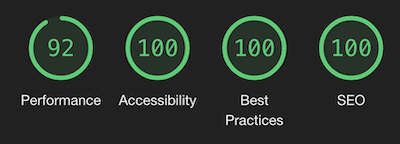
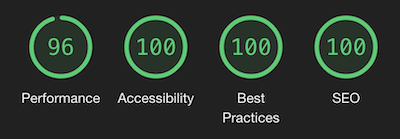
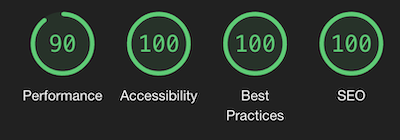
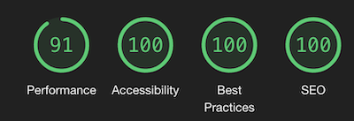
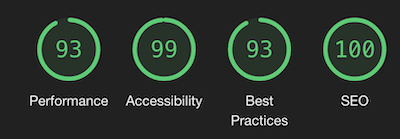
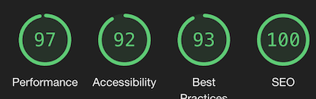
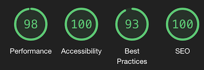
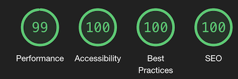
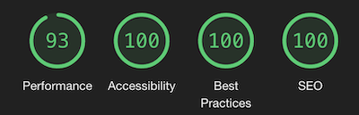
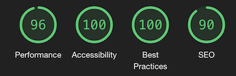

# Testing for Milestron Project 3 - Game Corner
---

## Chrome Developer Tools - Lighthouse

### Lighthouse Results
#### Admin Pages
##### Admin (Desktop - Mobile)

##### Game Search (Desktop - Mobile)

##### Review Search (Desktop - Mobile)

##### User Search (Desktop - Mobile)

#### User Pages
##### Login (Desktop - Mobile)

##### Profile Game Search (Desktop - Mobile)

##### Settings (Desktop - Mobile)

##### Your Reviews (Desktop - Mobile)

##### Profile Page (Desktop - Mobile)

##### Register (Desktop - Mobile)

##### User Game Search (API) (Desktop - Mobile)

#### Game Pages
##### Game Page (Desktop - Mobile)

##### Games Page (Desktop - Mobile)

##### Latest Reviews (Desktop - Mobile)

#### Base Pages
##### Index (Desktop - Mobile)

---

## Testing Process - User

### User
The user testing will follow these steps:
- Visit index page
- Click onto the latest reviews link in nav to see latest reviews
- Click onto a game from a review
- Taken to game page
- Read description, look at reviews, watch a video, click on a buy link
- Click on the games link in nav
- Browse games, going throgugh pagination
- Search for a game using the search bar
- Click on a game to view it
- Click Register link in nav
- enter details into registration form and sign up
- take to profile page
- click to add a new review
- search for a game
- click add review
- leave a review for game
- click profile in nav bar
- click to add a new review
- Add a new game
- Search for game
- Select Game
- Taken to game page
- Leave a review
- Edit game info
- click profile > your reviews from nav
- taken to your reviews page
- edit a review
- click profile>settings from nav
- enter old & new password and update password
#### Extra steps for Admin
- click on profile form nav
- click Admin Panel
- Click Manage Users
- start typing a username then select user
- Click Edit user
- change user name & user type. Update user
- start typing a username then select user
- Click Delete user and confirm
- click on manage games
- start typing a game name then select game
- Check the edit history
- Click Edit
- Edit the game description
- update game 
- return to profie admin panel
- Click Manage Reviews
- start typing a game's name then select game
- Click Edit review
- update review
- return to profie admin panel
- Click Manage Reviews
- start typing a game's name then select game
- Delete a review

## Chrome Developer Tools

---
### iPhone 5/SE 320x568 & 568x320

---
### iPhone 6/7/8 357x667 & 667x357

---
### iPhone 6/7/8 Plus 414x736 & 736x414

---
### iPad 768x1024 & 1024x768

---
### iPad Pro 1024x1336 1336x1024

---
## Handheld Device Realworld Testing - Testing Log
---
### iPhone XS Max (Safari)

---
### iPhone 12 Pro (Safari)

---
### iPad Pro 11 (Safari)

---
### Samsung A40 (Chrome)

---
## Screen Testing - Testing Log
---
### Laptop 13" Screen 1280x800

---
### Laptop 16" Screen 3072x1920

---
### Desktop 22" Screen 1680x1050

---
### iMac 5k 27" Screen 5120x2880

---
